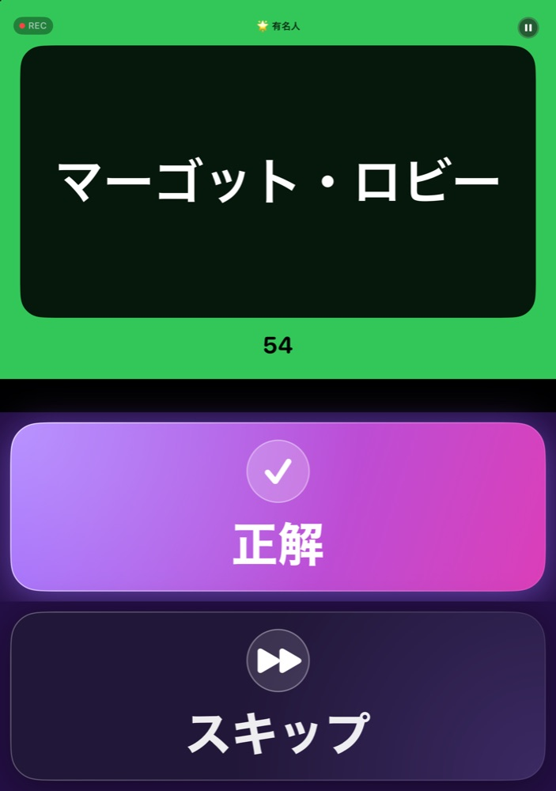
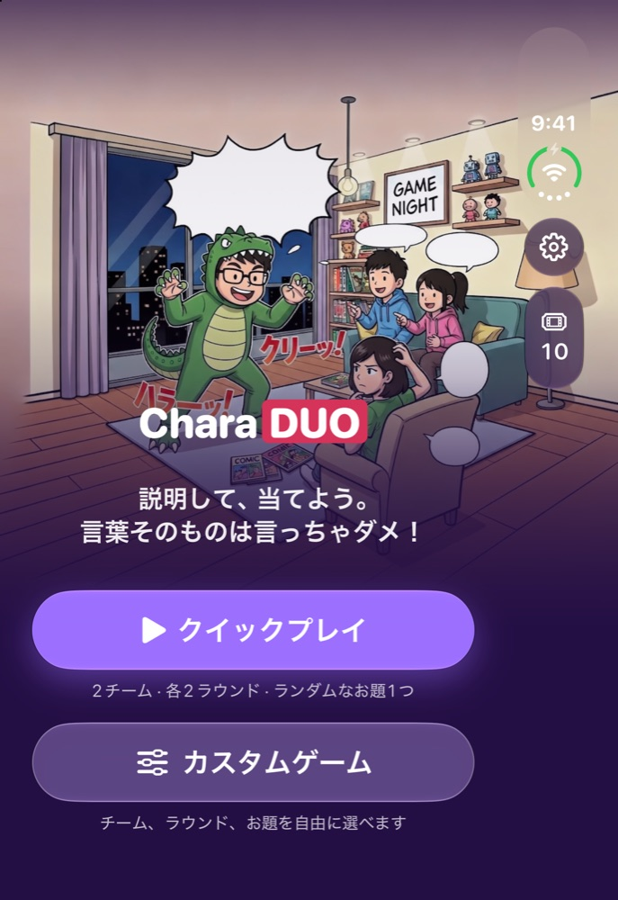
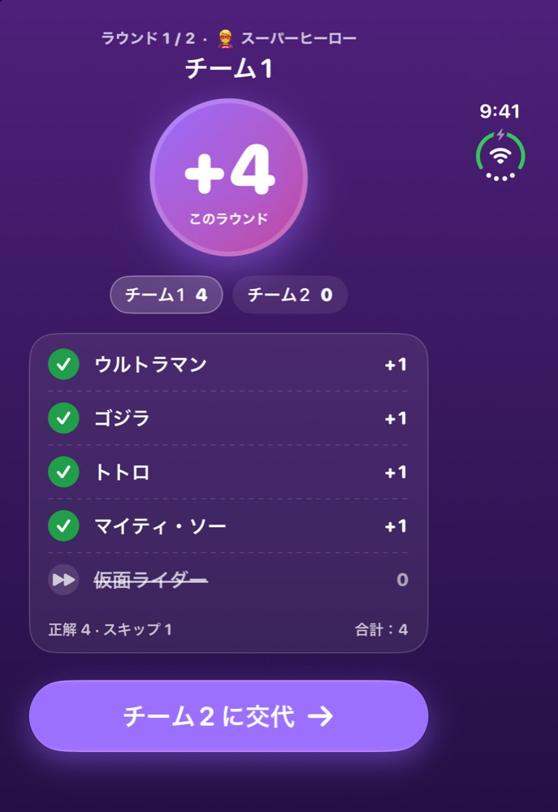
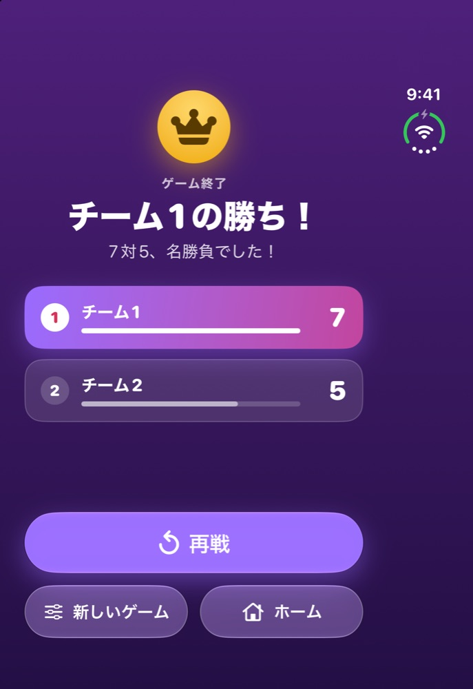
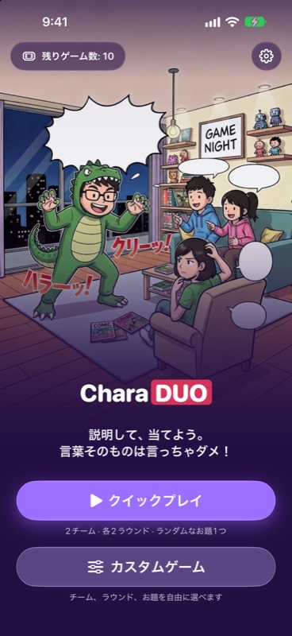
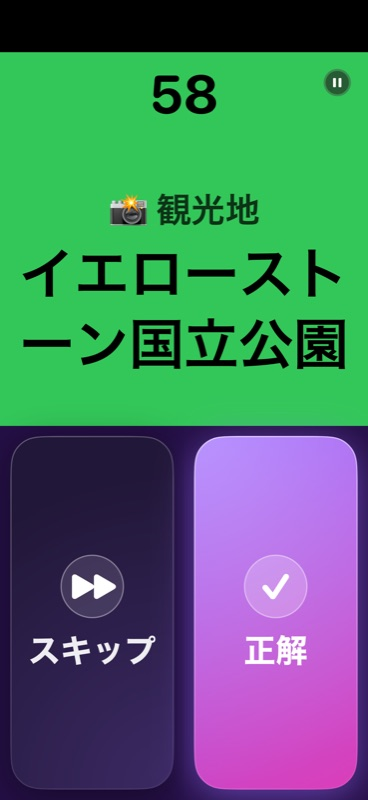
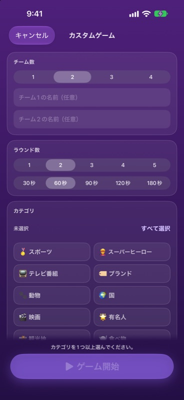
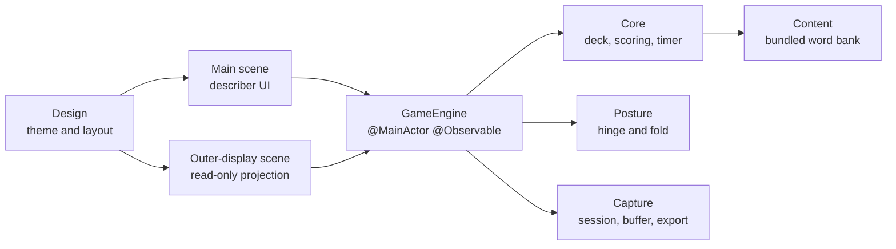

# CharaDUO

**言わずに伝えて、みんなで当てよう！**

iPhone Duo をテーブルに置いて遊ぶために生まれた、パーティー向けジェスチャーゲーム。

[English](README.md) · [繁體中文](README.zh-Hant.md) · [简体中文](README.zh-Hans.md) · [粵語](README.zh-HK.md) · **日本語**

 

&nbsp;&nbsp;

 テーブルモード：出題する人の内側ディスプレイ（左）と、答える人が見る外側ディスプレイ（右）。

---

## CharaDUO とは？

CharaDUO は、リビングで盛り上がる定番のジェスチャーゲーム。ひとりがお題を身振りや説明で伝え、チームのみんなが答えを叫び、制限時間がどんどん減っていきます。正解なら **Correct**、パスなら **Skip** をタップ。いちばん得点の多いチームの勝ちです。

**どの iPhone でも**遊べます——スマホを回すだけ。そして **iPhone Duo** なら、ほかのジェスチャーアプリにはできない遊び方ができます。

## iPhone Duo のために

iPhone Duo をノートパソコンのように折ってテーブルに立てると、ゲームが両側に自動で分かれます：

| 🧑‍🎤 出題する人 | 👀 答える人 |
|---|---|
| 立っている内側ディスプレイには、コントラストの高いカードで**お題**を表示。テーブルに寝ているもう半分は、特大の **Correct** と **Skip** ボタンです。 | みんなのほうを向く**外側ディスプレイ**には、ジャンル、カウントダウン、文字数ぶんの絵文字（答えの長さのヒント）、スコアを表示。お題そのものは表示されません。 |

 出題する人の内側ディスプレイ：ホーム、ラウンド結果、ゲーム終了。

 

タイマーが動いている間、Duo のカメラが**答える人たちのリアクション**を（音声つきで）そっと記録。対戦が終わると、名場面を集めた**リアクションリール**が完成します。1倍・2倍・3倍速で再生（声が変わるおまけつき）、「写真」への保存もできます。

> **Duo がなくても大丈夫。** 外側ディスプレイとカメラはあくまで追加機能です。1画面だけでもゲームは丸ごと楽しめて、カメラの許可を求めることもありません。

 ふつうの iPhone でも快適に遊べます——Duo は不要です。

## 特長

- 🎭 **10ジャンル・1,394ワード**——映画、テレビ、有名人、スーパーヒーロー、動物、食べ物、国、観光地、スポーツ、ブランド。
- 🌏 **5つの言語、ひとつのゲーム**——画面もお題も、それぞれネイティブの言葉で作成。広東語ならお題は香港寄り、日本語なら日本寄りに出やすくなります（70 / 30 の地域デッキ）。
- ⏱️ **ひと目でわかるカウントダウン**——大きな数字が減っていき、背景は緑 → 黄 → 赤へ。
- 🎛️ **クイックプレイ or カスタムゲーム**——チーム数、ラウンド数、ジャンル、制限時間（30〜180秒）、お題の言語、パスのペナルティを選べます。
- 🎬 **リアクションリール**（iPhone Duo）——答える人たちの名場面を、必要なときに「写真」へ書き出せます。
- 🔒 **プライバシー重視**——アカウント不要、広告なし、アナリティクスなし。映像と音声は端末の外に出ず、保存しなかったクリップは対戦終了時に削除されます。
- ♿ **アクセシビリティ**——ダイナミックタイプ、44pt のタップ領域、VoiceOver ラベルに対応。色だけで情報を伝えません。
- 💸 **わかりやすい価格**——最初の10ゲームは無料。その後は $0.99 で10ゲーム追加、または $2.99 で無制限。買い切りで**サブスクなし**。

## 5つの言語、ひとつのゲーム

 答える人が見る外側ディスプレイを5言語で——ジャンル、カウントダウン、文字数ぶんの絵文字、スコア。

アプリはスマホの言語に合わせて表示され、設定でいつでも変更できます。カスタムゲームでは、お題の言語を画面の言語と別にすることもできます。

## ステータス

CharaDUO **1.0.0（ビルド 14）** は **2026-10-06** に App Store へ提出済みで、現在審査待ちです（初回リリース）。1.0.0 より前はすべてプレリリースの開発版です（`v0.x`）。

## 技術情報

サードパーティ依存**ゼロ**のネイティブアプリです。

- **SwiftUI**、**Swift 6** の厳格な並行処理、iOS 27.1+。`@MainActor @Observable` な単一の `GameEngine` が唯一の情報源で、メインシーンと外側ディスプレイのシーン（読み取り専用の投影）で共有されます。
- 姿勢は `onHingeChange` で取得し、折り目は `reservedRegions` で特定。50/50 の固定分割はしていません。
- **外側ディスプレイ**は `cameraCapture` シーンアクセサリです。システムがいつでも付与・取り消しできるため、ゲームはこれに一切依存せず、ラウンド中に消えても中断しません。
- **リアクションカメラ**：対戦全体で1つの `AVCaptureSession`、約2秒の `AVAssetWriter` セグメントによるローリングバッファで、名場面だけを保持。答える人に向いたカメラは `AVCaptureDeviceDirectionCoordinator` で特定し、書き出しは保存時まで遅延して `AVMutableComposition`（1×/2×/3×）で処理します。
- **タイマー**は積算ティックではなく `ContinuousClock` の実時間差を使うので、バックグラウンドを挟んでもずれません。
- **ワードバンク**はビルド時にスプレッドシートから生成した JSON（繁体字→簡体字変換と検証つき）を同梱し、メモリに読み込みます。
- モジュール化された **Swift パッケージ**（`Core`、`Content`、`ContentPipeline`、`Posture`、`Capture`、`Design`）に 140 件のユニットテスト、起動引数で動く UI テストを用意。

## ソースコード

ソースコードはリリースまで非公開です。アーキテクチャ・コード・テストについては、[GitHub プロフィール](https://github.com/ryopang) からご連絡いただければ喜んでご説明します。

## サポートとプライバシー

- サポート：[サポートページ](https://ryopang.github.io/CharaDUO/) · [プライバシーポリシー](https://ryopang.github.io/CharaDUO/privacy)
- CharaDUO は**データを一切収集しません**。映像は端末内にとどまります。

---

ひとりのインディー開発者が作りました。遊んでくれてありがとう！❤️ · © 2026 Yui Pang. All rights reserved.

