

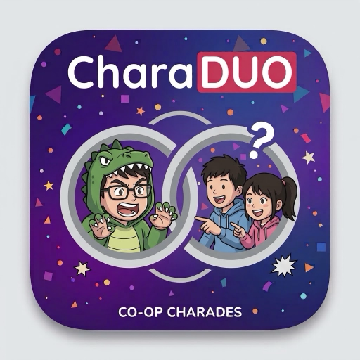

# CharaDUO

**Describe it. Guess it. Don't say the word.**

A party charades game for iPhone — built around the way iPhone Duo folds into a tabletop.

**English** · [繁體中文](README.zh-Hant.md) · [简体中文](README.zh-Hans.md) · [粵語](README.zh-HK.md) · [日本語](README.ja.md)

 

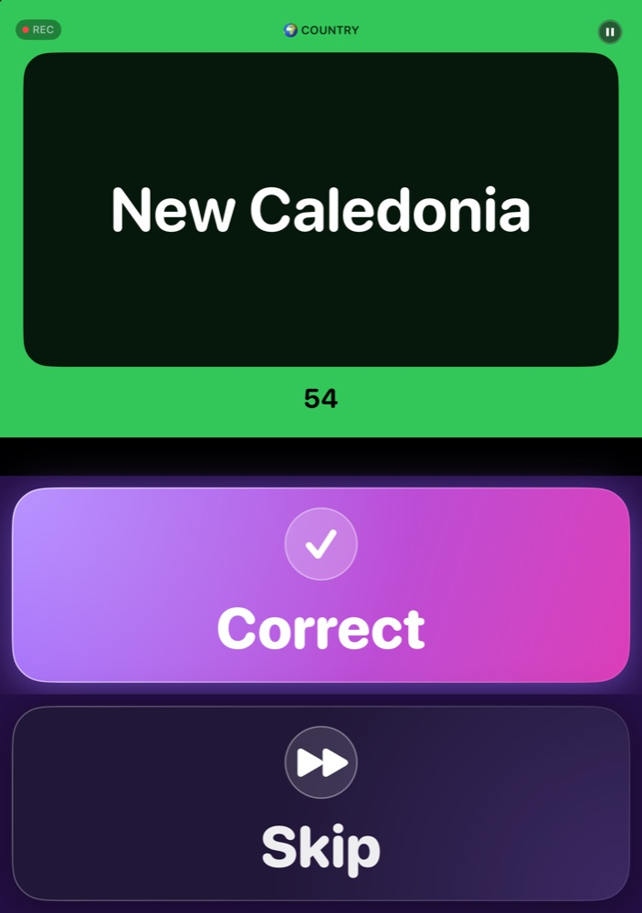
&nbsp;&nbsp;
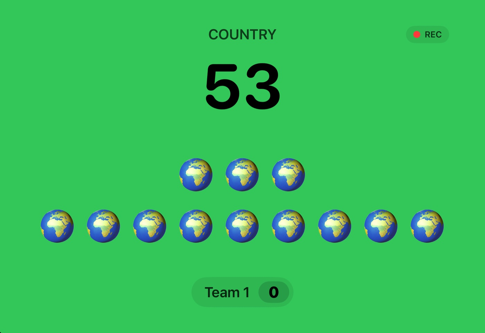
 Tabletop posture: the describer's inner display (left) and the outer display the guessers watch (right).

---

## What is it?

CharaDUO is classic charades for a living room: one player acts out or describes
a word, their team shouts guesses, and the clock runs down. Tap **Correct** to
score, **Skip** to move on. The team with the most points wins.

It plays great on **any iPhone** — pass the phone, hold it up, go. And on an
**iPhone Duo** it does something no other charades app can.

## Built for iPhone Duo

Fold an iPhone Duo into a laptop shape, stand it on the table and the game
splits itself across both halves:

| 🧑‍🎤 Describer | 👀 Guessers |
|---|---|
| The upright inner half shows the **word** on a high-contrast card. The half lying on the table is one giant **Correct** and **Skip**. | The **outer display** faces the room: category, the countdown, one emoji per letter so they know how long the answer is, and the score. The word never appears. |

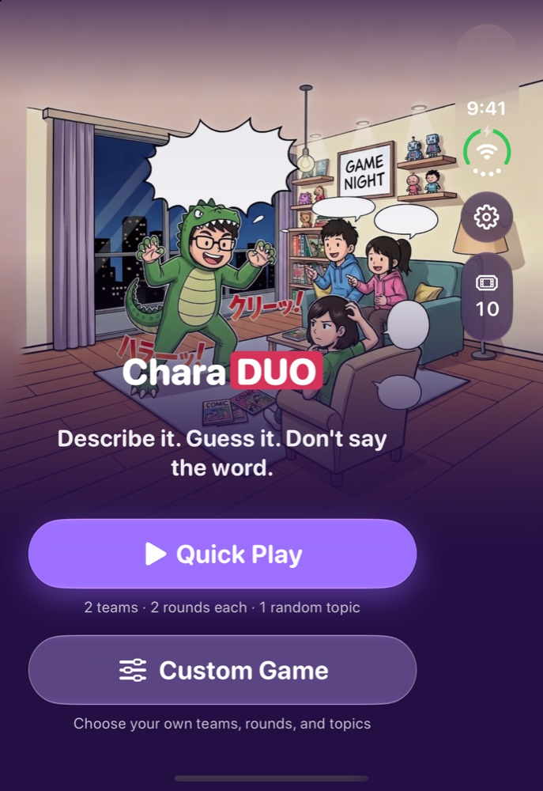

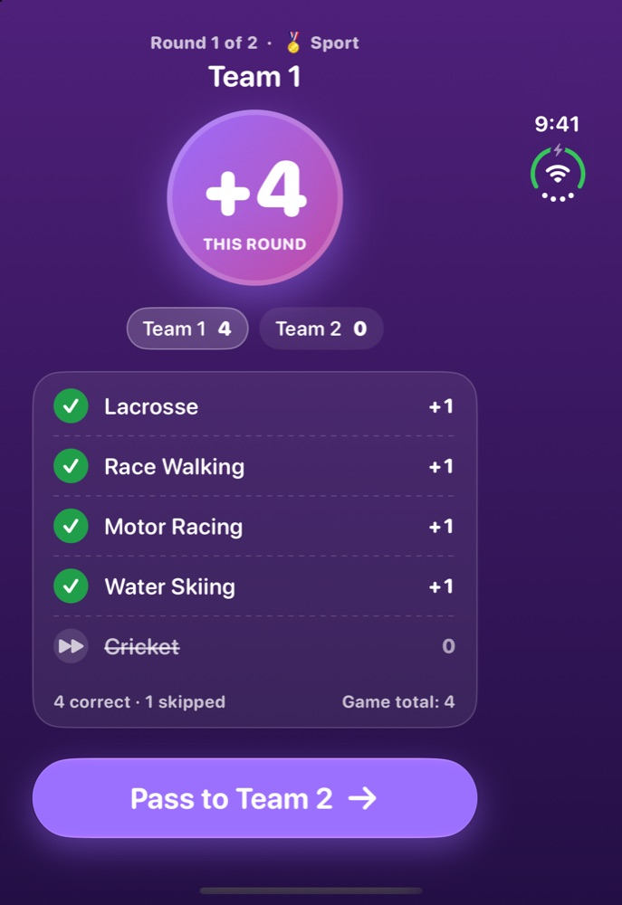
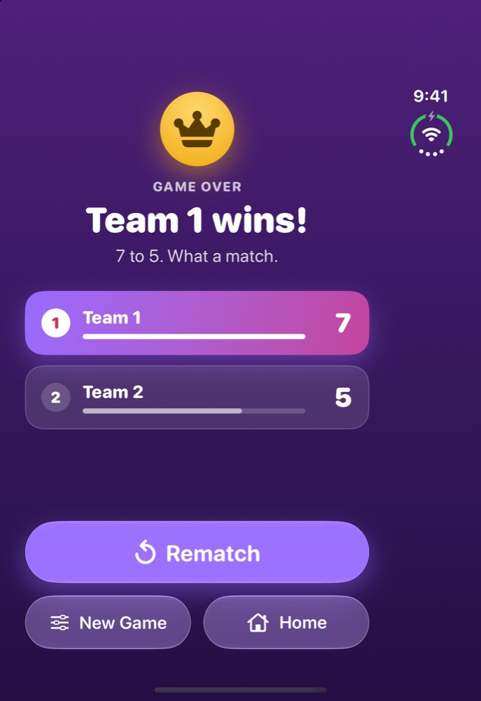
 The describer's inner display: Home, Round Summary, Game Over.

 

While the clock runs, the Duo's camera quietly records the **guessers' reactions**
(with audio). At the end of the match you get a **Reaction Reel** of the best
moments, replayable at 1×, 2× or 3× — chipmunk voices included — and savable to Photos.

> **No Duo? No problem.** The whole outer-display and camera layer is an
> enhancement. The single-screen game is complete on its own and never asks
> for the camera.

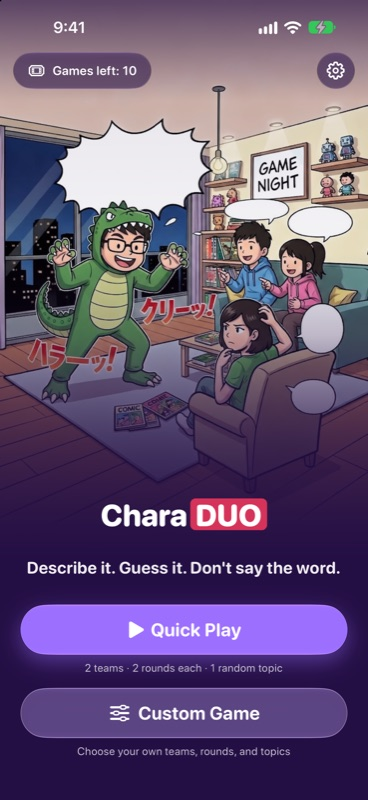
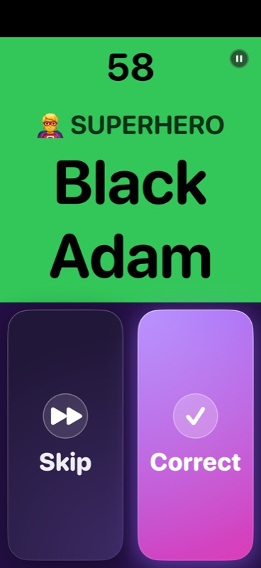
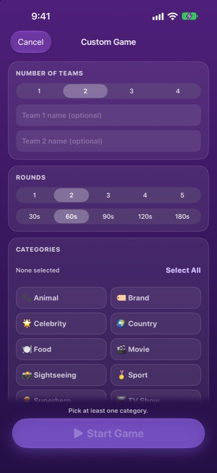
 Also plays beautifully on a regular iPhone — no Duo needed.

## Features

- 🎭 **10 categories, 1,394 words** — movies, TV shows, celebrities, superheroes,
  animals, food, countries, sightseeing, sports and brands.
- 🌏 **Five languages, one game** — the interface *and* the word bank, each
  written natively. Hong Kong words are drawn more often for Cantonese players,
  Japan-focused ones for Japanese players (a 70 / 30 regional deck).
- ⏱️ **A countdown you can read at a glance** — big descending digits on a
  green → amber → red background.
- 🎛️ **Quick Play or Custom Game** — pick teams, rounds, categories, round
  length (30–180 s), word language and skip penalty.
- 🎬 **Reaction Reel** *(iPhone Duo)* — highlights of your guessers, export to Photos whenever you like.
- 🔒 **Private by design** — no accounts, no ads, no analytics. Video and audio
  never leave the phone; unsaved clips are deleted when the match ends.
- ♿ **Accessible** — Dynamic Type, 44 pt tap targets, VoiceOver labels, and a
  layout that never relies on colour alone.
- 💸 **Fair pricing** — 10 free games, then a one-time $0.99 for 10 more or
  $2.99 for unlimited. **No subscription.**

## Five languages, one game

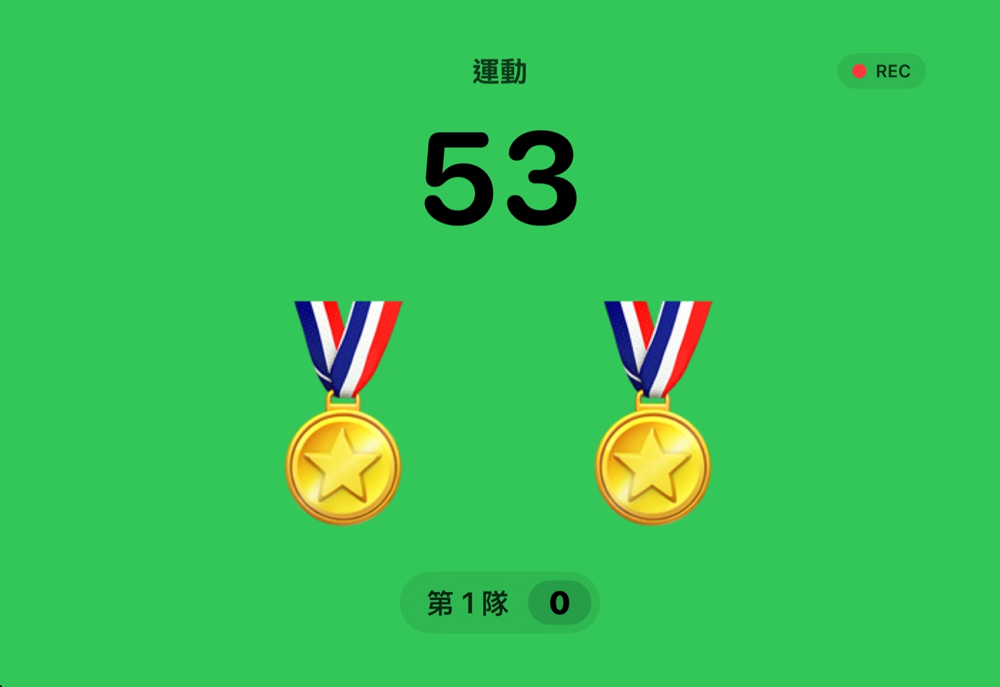
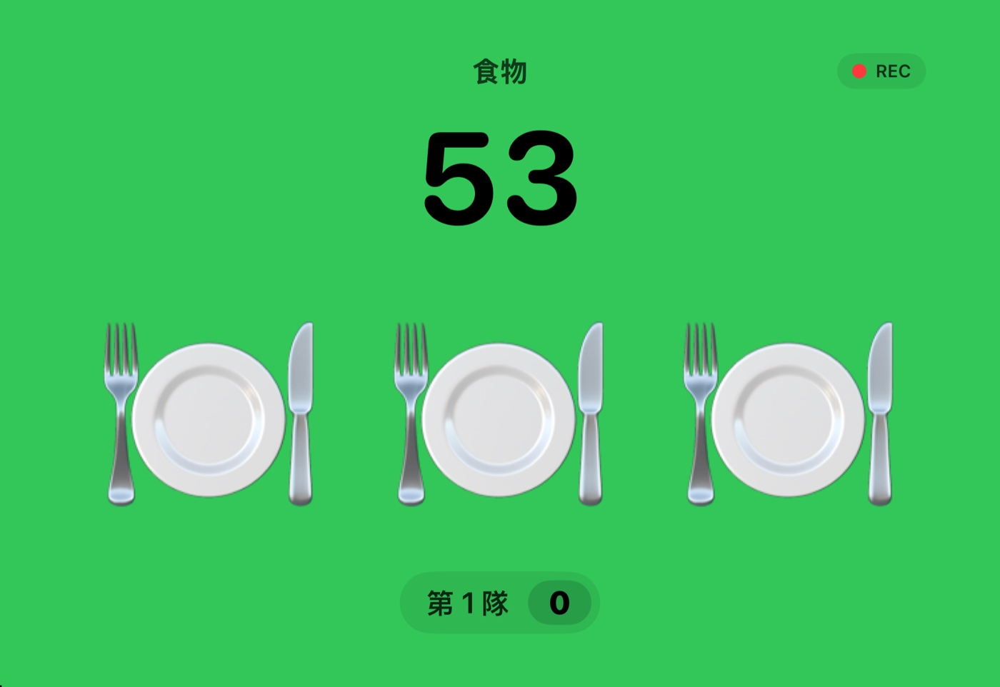
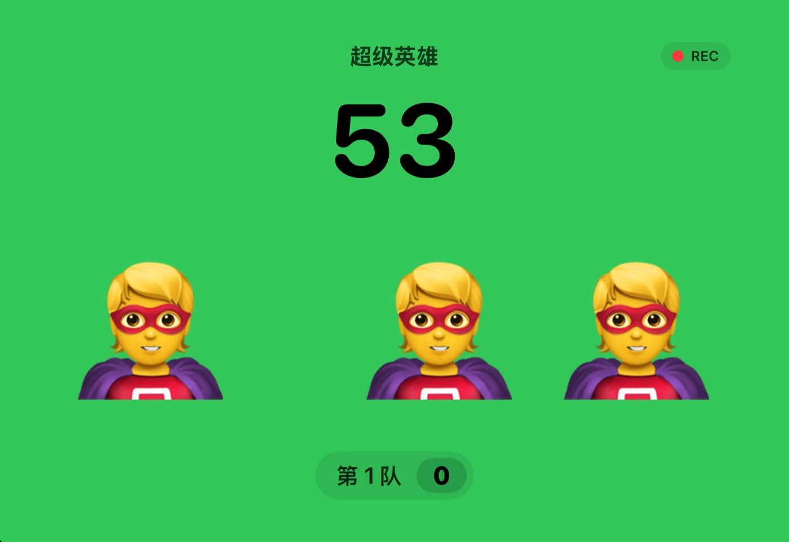
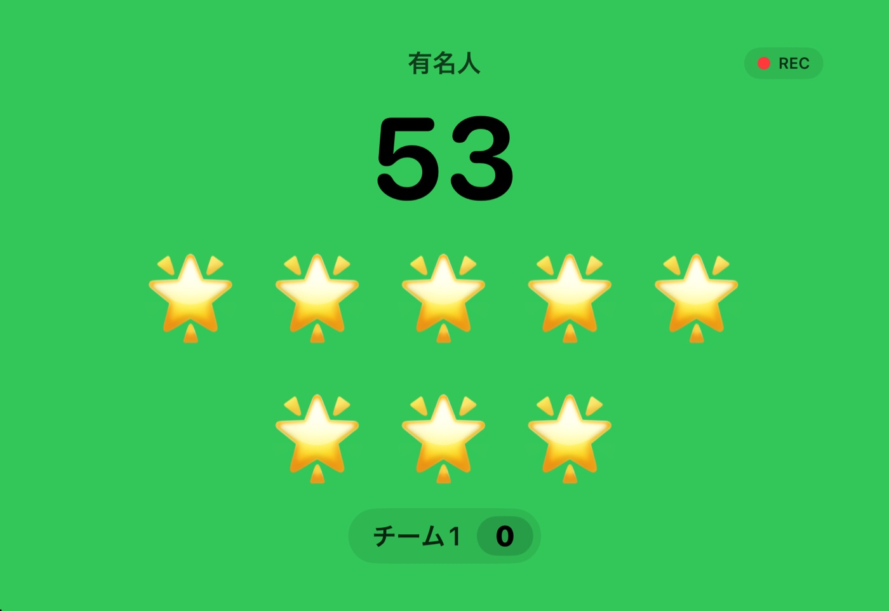
 The guessers' outer display in each language — category, countdown, one emoji per letter, and the score.

The app follows your phone's language until you pick one in Settings; a
Custom Game can also play the words in a different language from the interface.

## Status

CharaDUO **1.0.0 (build 14)** was submitted to the App Store on **2026-10-06** and is waiting for review — it is the first release. Everything before 1.0.0 was pre-release development (`v0.x`).

## Under the hood

A native app with no third-party dependencies.

- **SwiftUI**, **Swift 6** strict concurrency, iOS 27.1+. One
  `@MainActor @Observable` `GameEngine` is the single source of truth, shared by
  the main scene and the outer-display scene (a read-only projection).
- **Hinge & posture** from `onHingeChange`; the fold crease is located with
  `reservedRegions` — nothing hard-codes a 50/50 split.
- **Outer display** is a `cameraCapture` scene accessory. The system can grant
  or revoke it at any moment, so nothing in the game depends on it and it can
  vanish mid-round without interrupting play.
- **Reaction camera**: an `AVCaptureSession` for the whole match, a rolling
  buffer of ~2 s `AVAssetWriter` segments, and only the highlight windows kept.
  The camera facing the guessers is found with `AVCaptureDeviceDirectionCoordinator`.
  Export is a deferred `AVMutableComposition` (1×/2×/3×).
- **Timer** from `ContinuousClock` wall-clock deltas, never accumulated ticks,
  so it stays right across backgrounding.
- **Word bank** is bundled JSON built from a spreadsheet at build time (Traditional →
  Simplified conversion and validation included), decoded into memory.
- Modular **Swift packages** (`Core`, `Content`, `ContentPipeline`, `Posture`,
  `Capture`, `Design`) with 140 unit tests, plus a UI suite driven by launch flags.

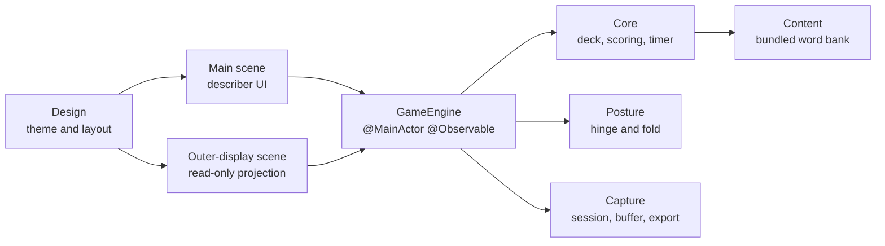

## Source code

The source is private until launch. I'm happy to walk through the architecture, code and tests on request — reach me through my [GitHub profile](https://github.com/ryopang).

## Support & privacy

- Support: [charaduo support page](https://ryopang.github.io/CharaDUO/) · [Privacy policy](https://ryopang.github.io/CharaDUO/privacy)
- CharaDUO collects **no data**. Footage stays on the device.

---

Made by one indie developer. Thanks for playing! ❤️ · © 2026 Yui Pang. All rights reserved.

