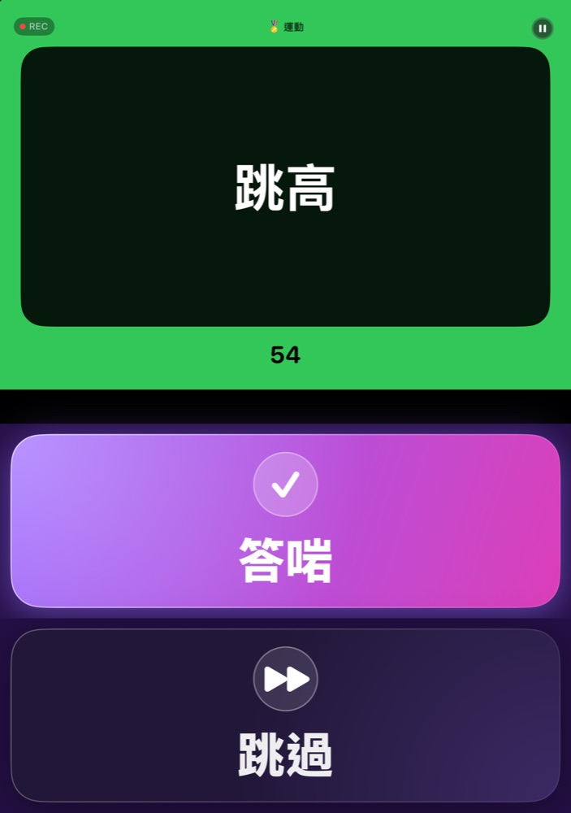
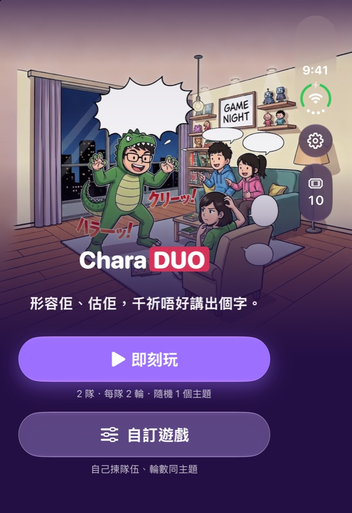
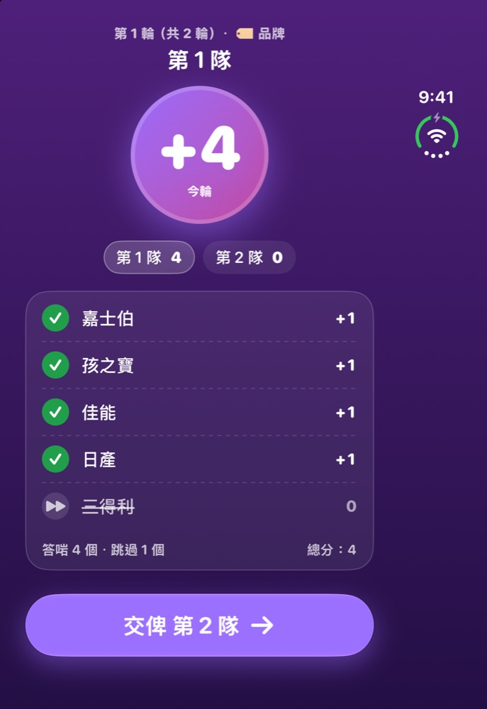
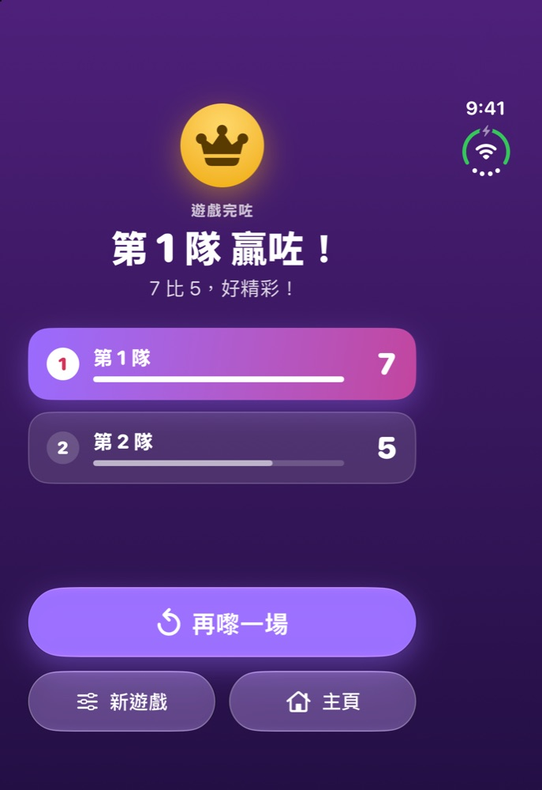
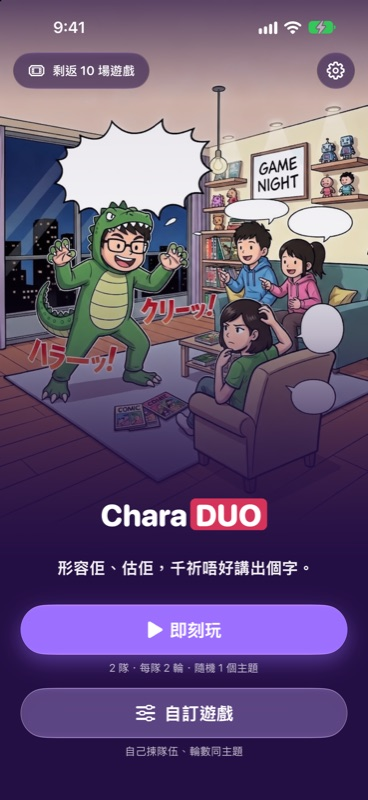
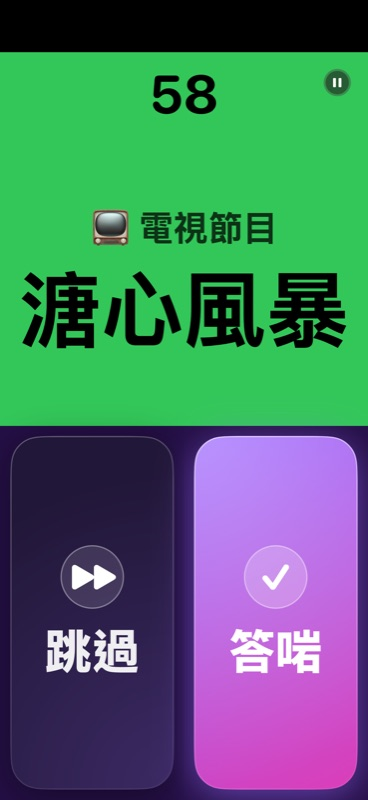
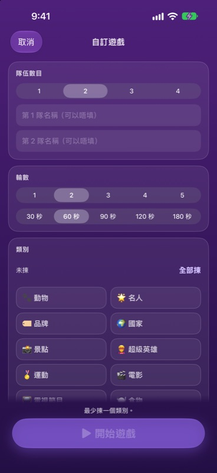
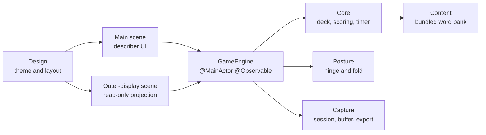

# CharaDUO

**用做嘅、用估嘅，千祈唔好講出答案！**

專為 iPhone Duo 摺成枱面姿態而設嘅派對比手畫腳遊戲。

[English](README.md) · [繁體中文](README.zh-Hant.md) · [简体中文](README.zh-Hans.md) · **粵語** · [日本語](README.ja.md)

 

&nbsp;&nbsp;

 枱面姿態：做嘅人嘅內屏（左）同估嘅人睇嘅外屏（右）。

---

## 呢個係咩？

CharaDUO 係適合喺客廳玩嘅經典比手畫腳：一個人用動作或者描述俾隊友估字，時間一秒一秒倒數。估啱就㩒 **Correct**，想轉題就㩒 **Skip**，最後得分最高嘅隊伍贏。

**任何 iPhone** 都玩得——傳部電話、舉起就開始。而喺 **iPhone Duo** 上面，仲有其他比手畫腳 App 做唔到嘅玩法。

## 為 iPhone Duo 而設

將 iPhone Duo 摺成手提電腦嘅樣，企喺枱面，遊戲會自動分到兩邊：

| 🧑‍🎤 做嘅人 | 👀 估嘅人 |
|---|---|
| 企直嗰邊嘅內屏用高對比卡片顯示**題目**；平放喺枱面嗰邊就係超大嘅 **Correct** 同 **Skip**。 | 對住大家嘅**外屏**顯示類別、倒數、每隻字一個表情符號（等大家知道答案有幾多隻字），仲有分數——絕對唔會顯示答案本身。 |

 做嘅人嘅內屏：主畫面、回合結算、遊戲完結。

 

倒數嗰陣，Duo 部相機會靜靜雞錄低**估嘅人嘅反應**（連聲音）。對戰完咗，你會有一段**精彩反應重溫**，可以用 1 倍、2 倍或者 3 倍速重播（連搞笑變聲），仲可以儲落「相片」。

> **冇 Duo 都冇問題。** 外屏同相機只係額外功能，單屏玩法本身已經好完整，而且絕對唔會要求用相機。

 普通 iPhone 一樣玩得好順——唔使 Duo。

## 特色

- 🎭 **10 大類別、1,394 個詞彙**——電影、電視、名人、超級英雄、動物、美食、國家、景點、運動同品牌。
- 🌏 **五種語言一款遊戲**——介面同詞庫都係由母語寫成。廣東話玩家會較常抽到香港詞彙，日文玩家就較常抽到日本詞彙（70 / 30 地區牌組）。
- ⏱️ **一眼睇清嘅倒數**——大大隻遞減數字，背景由綠變琥珀再變紅。
- 🎛️ **快速開始或者自訂遊戲**——自選隊伍數、回合數、類別、回合時長（30–180 秒）、詞彙語言同跳題扣分。
- 🎬 **精彩反應重溫**（iPhone Duo）——估嘅人嘅精彩一刻，有需要可以匯出去部電話嘅相簿。
- 🔒 **私隱至上**——唔使註冊、冇廣告、冇追蹤分析。影像同聲音絕對唔會離開部電話；冇儲起嘅片段會喺對戰完咗之後刪走。
- ♿ **無障礙**——支援動態字體、44 pt 點按範圍、VoiceOver 標籤，而且唔會淨係靠顏色傳達資訊。
- 💸 **價錢公道**——頭 10 場免費，之後 $0.99 加購 10 場，或者 $2.99 無限玩，一次性買斷，**冇訂閱**。

## 五種語言，一款遊戲

 估嘅人睇嘅外屏（五種語言）——類別、倒數、每隻字一個表情符號，同分數。

App 預設跟住部電話嘅語言，亦都可以喺設定入面自己轉；自訂遊戲仲可以令詞彙語言同介面語言唔同。

## 而家狀態

CharaDUO **1.0.0（build 14）** 已經喺 **2026-10-06** 提交 App Store，等緊審批——呢個係第一個版本。1.0.0 之前全部都係預覽開發版本（`v0.x`）。

## 技術細節

原生 App，**零第三方依賴**。

- **SwiftUI**、**Swift 6** 嚴格並行、iOS 27.1+。單一 `@MainActor @Observable` 嘅 `GameEngine` 係唯一資料來源，由主場景同外屏場景共用（後者係唯讀投影）。
- 用 `onHingeChange` 攞姿態，再用 `reservedRegions` 搵出摺位——唔會寫死 50/50 分割。
- **外屏**係 `cameraCapture` 場景配件。系統隨時可以俾或者收返，所以遊戲完全唔依賴佢，回合中途冇咗都唔會中斷。
- **反應相機**：成場對戰保持一個 `AVCaptureSession`，用約 2 秒嘅 `AVAssetWriter` 片段滾動緩衝，只留精彩時段；用 `AVCaptureDeviceDirectionCoordinator` 搵出對住估嘅人嗰粒鏡頭；匯出押後到儲存先做，用 `AVMutableComposition` 處理 1×/2×/3×。
- **計時器**用 `ContinuousClock` 嘅實際時間差，唔係累加 tick，所以入咗背景都唔會唔準。
- **詞庫**喺建置時由試算表轉成內置 JSON（包括繁→簡轉換同驗證），載入記憶體用。
- 模組化 **Swift 套件**（`Core`、`Content`、`ContentPipeline`、`Posture`、`Capture`、`Design`），有 140 個單元測試，加埋用啟動參數驅動嘅 UI 測試。

## 原始碼

原始碼上架前保持私有。歡迎透過我嘅 [GitHub 主頁](https://github.com/ryopang) 聯絡，我好樂意介紹架構、程式碼同測試。

## 支援同私隱

- 支援：[支援頁面](https://ryopang.github.io/CharaDUO/) · [私隱政策](https://ryopang.github.io/CharaDUO/privacy)
- CharaDUO **唔會收集任何資料**，影像淨係留喺你部機。

---

由一位獨立開發者製作。多謝你嚟玩！❤️ · © 2026 Yui Pang. All rights reserved.

