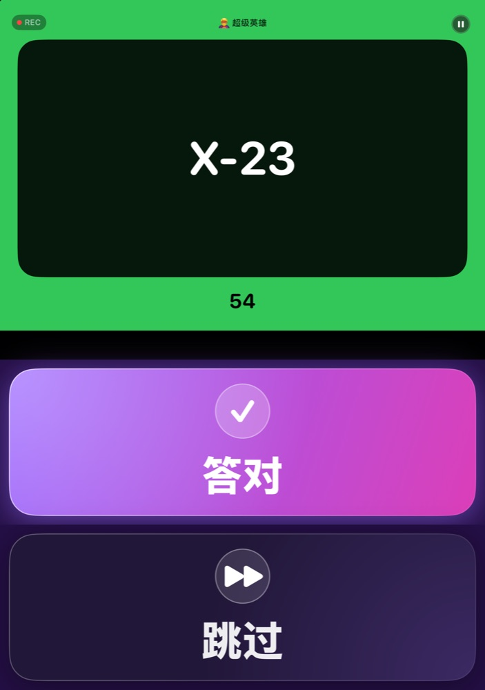
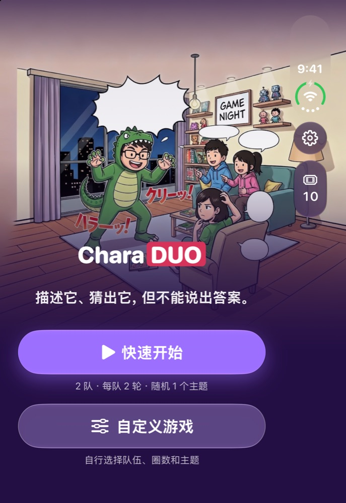
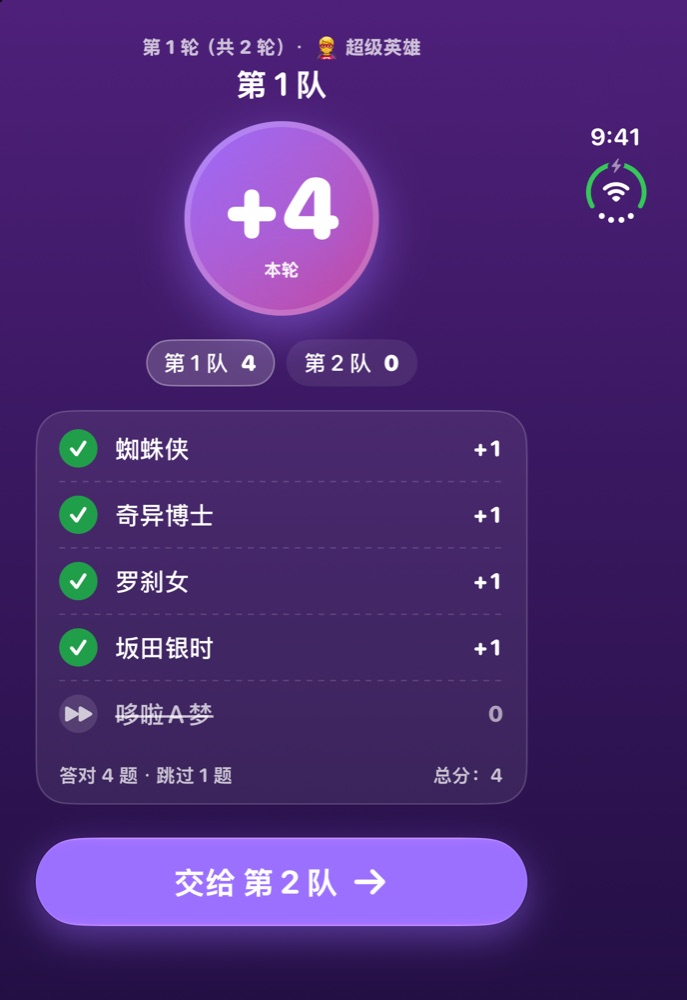
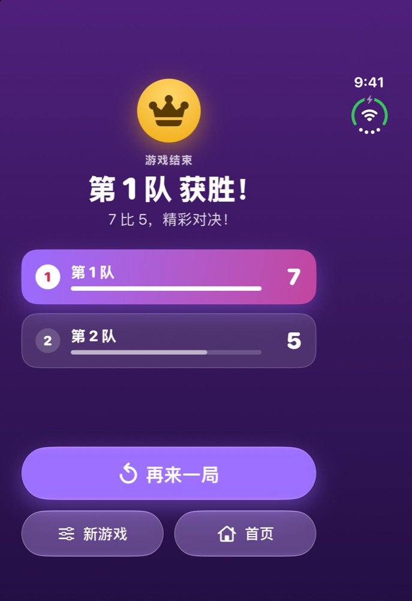
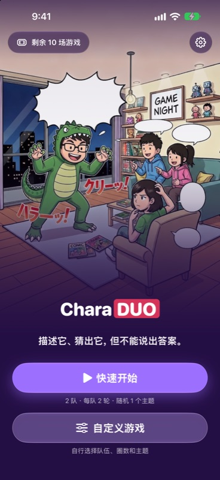
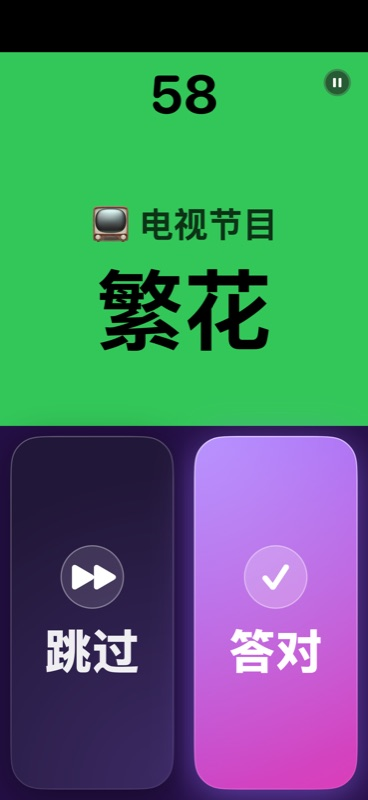
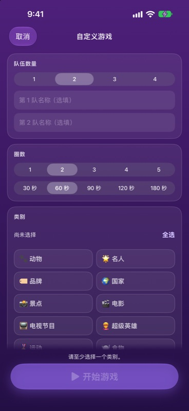
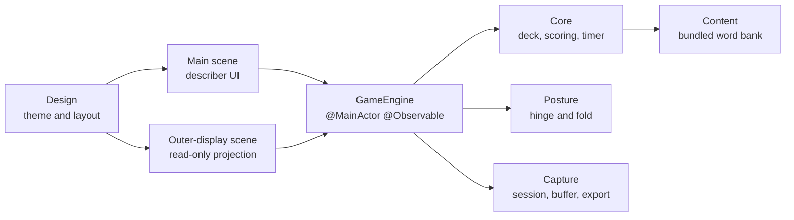

# CharaDUO

**你来比划，大家来猜，就是不能说出答案！**

专为 iPhone Duo 折叠成桌面姿态而生的派对你比我猜游戏。

[English](README.md) · [繁體中文](README.zh-Hant.md) · **简体中文** · [粵語](README.zh-HK.md) · [日本語](README.ja.md)

 

&nbsp;&nbsp;

 桌面姿态：比划者的内侧屏幕（左）与猜题者看的外侧屏幕（右）。

---

## 这是什么？

CharaDUO 是适合客厅的经典你比我猜：一个人用动作或描述让队友猜词，时间一秒一秒倒数。猜对按 **Correct**，想换题按 **Skip**，最后得分最高的队伍获胜。

**任何 iPhone** 都能玩——传着手机、举起来就开始。而在 **iPhone Duo** 上，它还有其他你比我猜 App 做不到的玩法。

## 专为 iPhone Duo 打造

把 iPhone Duo 折成笔记本的样子立在桌上，游戏会自动分配到两侧：

| 🧑‍🎤 比划的人 | 👀 猜题的人 |
|---|---|
| 直立的内侧屏幕用高对比卡片显示**题目**；平放在桌上的那一半是超大的 **Correct** 和 **Skip**。 | 朝向大家的**外侧屏幕**显示类别、倒数、每个字一个表情符号（让大家知道答案有几个字），以及分数——绝不显示答案本身。 |

 比划者的内侧屏幕：主界面、回合结算、游戏结束。

 

倒数期间，Duo 的相机会悄悄录下**猜题者的反应**（含声音）。对战结束后，你会得到一段**精彩反应回放**，可用 1 倍、2 倍或 3 倍速重播（含搞怪变声），还能存到“照片”。

> **没有 Duo 也没问题。** 外侧屏幕和相机只是加分功能，单屏玩法本身就很完整，而且绝不会要求使用相机。

 普通 iPhone 也能玩得很顺——不需要 Duo。

## 特色

- 🎭 **10 大类别、1,394 个词条**——电影、电视、名人、超级英雄、动物、美食、国家、景点、体育与品牌。
- 🌏 **五种语言一款游戏**——界面和词库都由母语写成。粤语玩家会更常抽到香港词条，日语玩家则更常抽到日本词条（70 / 30 地区牌组）。
- ⏱️ **一眼就看懂的倒数**——大大的递减数字，背景由绿到琥珀再到红。
- 🎛️ **快速开始或自定义游戏**——自选队伍数、回合数、类别、回合时长（30–180 秒）、词条语言和跳题扣分。
- 🎬 **精彩反应回放**（iPhone Duo）——猜题者的名场面，需要时可导出至手机内置相册。
- 🔒 **隐私至上**——无需账号、没有广告、没有统计追踪。视频和声音绝不离开手机；未保存的片段会在对战结束后删除。
- ♿ **无障碍**——支持动态字体、44 pt 点按区域、VoiceOver 标签，且不只靠颜色传达信息。
- 💸 **价格公道**——前 10 局免费，之后 $0.99 加购 10 局，或 $2.99 无限畅玩，一次性买断，**没有订阅**。

## 五种语言，一款游戏

 猜题者的外侧屏幕（五种语言）——类别、倒数、每个字一个表情符号，以及分数。

App 默认跟随手机语言，也可在设置中自行切换；自定义游戏还能让词条语言与界面语言不同。

## 当前状态

CharaDUO **1.0.0（build 14）** 已于 **2026-10-06** 提交 App Store，正在等待审核——这是首个版本。1.0.0 之前均为预览开发版本（`v0.x`）。

## 技术细节

原生 App，**零第三方依赖**。

- **SwiftUI**、**Swift 6** 严格并发、iOS 27.1+。单一 `@MainActor @Observable` 的 `GameEngine` 是唯一数据来源，由主场景与外侧屏幕场景共用（后者为只读投影）。
- 通过 `onHingeChange` 获取姿态，并用 `reservedRegions` 定位折痕——不写死 50/50 分割。
- **外侧屏幕**是 `cameraCapture` 场景配件。系统随时可能授予或收回，因此游戏完全不依赖它，回合中途消失也不会中断。
- **反应相机**：整场对战保持一个 `AVCaptureSession`，以约 2 秒的 `AVAssetWriter` 片段滚动缓冲，只保留精彩时段；用 `AVCaptureDeviceDirectionCoordinator` 找出朝向猜题者的镜头；导出推迟到保存时，用 `AVMutableComposition` 处理 1×/2×/3×。
- **计时器**使用 `ContinuousClock` 的实际时间差，而非累加 tick，因此进入后台也不会失准。
- **词库**在构建时由电子表格转成内置 JSON（含繁→简转换与校验），载入内存使用。
- 模块化 **Swift 包**（`Core`、`Content`、`ContentPipeline`、`Posture`、`Capture`、`Design`），含 140 个单元测试，以及由启动参数驱动的 UI 测试。

## 源代码

源代码在上架前保持私有。欢迎通过我的 [GitHub 主页](https://github.com/ryopang) 联系，我很乐意介绍架构、代码与测试。

## 支持与隐私

- 支持：[支持页面](https://ryopang.github.io/CharaDUO/) · [隐私政策](https://ryopang.github.io/CharaDUO/privacy)
- CharaDUO **不收集任何数据**，视频只留在你的设备上。

---

由一位独立开发者制作。感谢你来玩！❤️ · © 2026 Yui Pang. All rights reserved.

