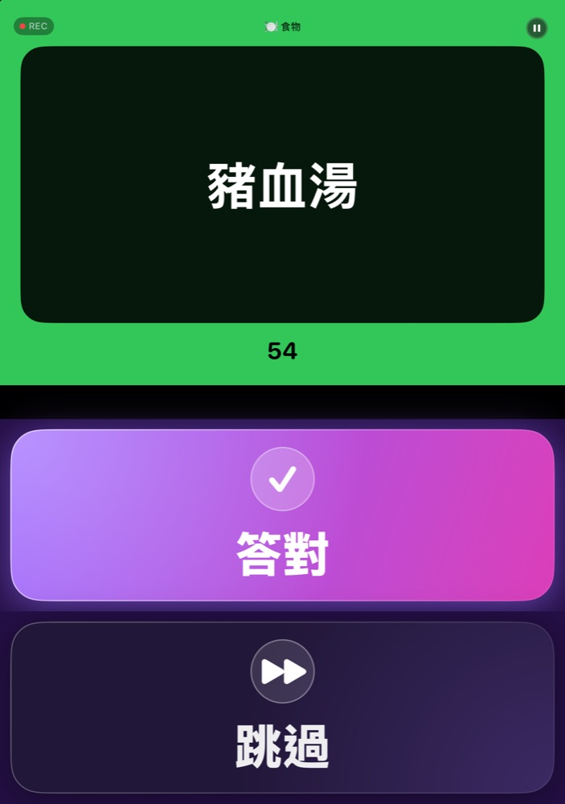
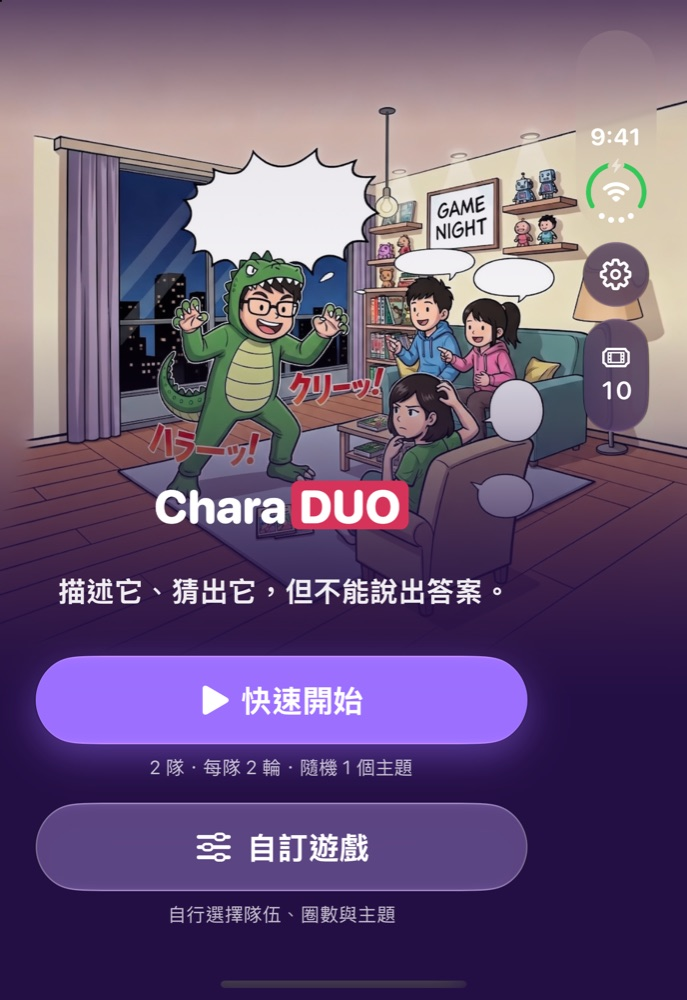
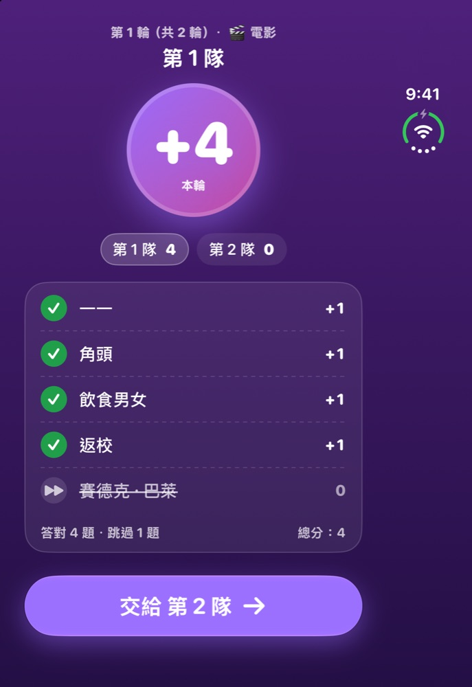
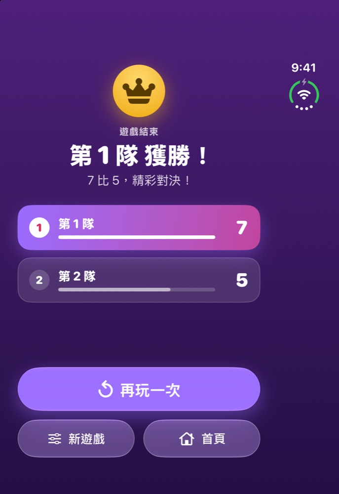
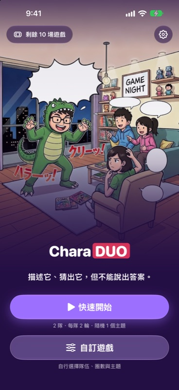
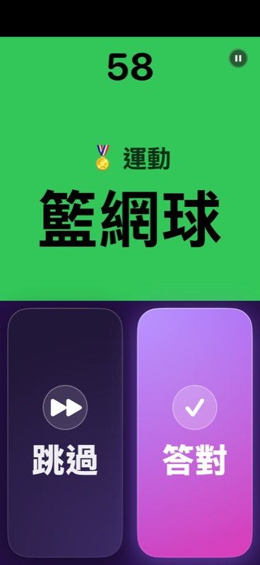
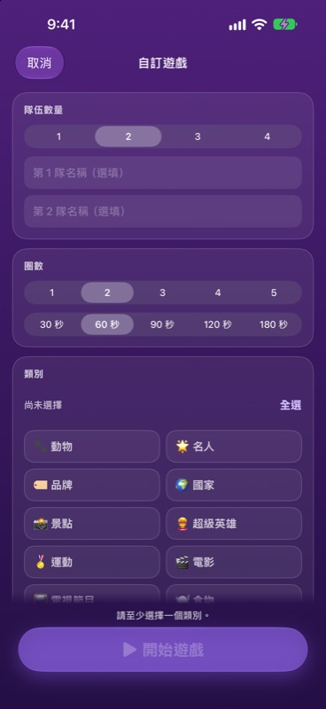
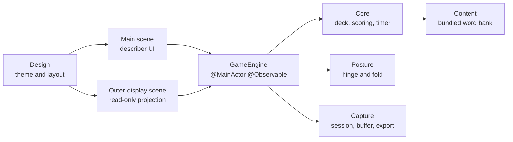

# CharaDUO

**用比的，用猜的，就是不能說出答案！**

專為 iPhone Duo 摺疊成桌面姿態而生的派對比手畫腳遊戲。

[English](README.md) · **繁體中文** · [简体中文](README.zh-Hans.md) · [粵語](README.zh-HK.md) · [日本語](README.ja.md)

 

&nbsp;&nbsp;

 桌面姿態：比畫者的內側螢幕（左）與猜題者看的外側螢幕（右）。

---

## 這是什麼？

CharaDUO 是適合客廳的經典比手畫腳：一個人用動作或描述讓隊友猜詞，時間一分一秒倒數。猜對按 **Correct**，想換題按 **Skip**，最後得分最高的隊伍獲勝。

**任何 iPhone** 都能玩——傳著手機、舉起來就開始。而在 **iPhone Duo** 上，它還有其他比手畫腳 App 做不到的玩法。

## 專為 iPhone Duo 打造

把 iPhone Duo 摺成筆電的樣子立在桌上，遊戲會自動分配到兩側：

| 🧑‍🎤 比畫的人 | 👀 猜題的人 |
|---|---|
| 直立的內側螢幕以高對比卡片顯示**題目**；平放在桌上的那一半則是超大的 **Correct** 與 **Skip**。 | 朝向大家的**外側螢幕**顯示類別、倒數、每個字一個表情符號（讓大家知道答案有幾個字），以及分數——絕不顯示答案本身。 |

 比畫者的內側螢幕：主畫面、回合結算、遊戲結束。

 

倒數期間，Duo 的相機會悄悄錄下**猜題者的反應**（含聲音）。對戰結束後，你會得到一支**精彩反應回放**，可用 1 倍、2 倍或 3 倍速重播（含搞笑變聲），還能存到「照片」。

> **沒有 Duo 也沒問題。** 外側螢幕與相機只是加分功能，單螢幕玩法本身就很完整，而且絕不會要求使用相機。

 一般 iPhone 也能玩得很順——不需要 Duo。

## 特色

- 🎭 **10 大類別、1,394 個詞彙**——電影、電視、名人、超級英雄、動物、美食、國家、景點、運動與品牌。
- 🌏 **五種語言一款遊戲**——介面與詞庫都由母語寫成。廣東話玩家會較常抽到香港詞彙，日文玩家則較常抽到日本詞彙（70 / 30 地區牌組）。
- ⏱️ **一眼就看懂的倒數**——大大的遞減數字，背景由綠到琥珀再到紅。
- 🎛️ **快速開始或自訂遊戲**——自選隊伍數、回合數、類別、回合時長（30–180 秒）、詞彙語言與跳題扣分。
- 🎬 **精彩反應回放**（iPhone Duo）——猜題者的名場面，需要時可匯出至手機內建相簿。
- 🔒 **隱私至上**——不需帳號、沒有廣告、沒有分析追蹤。影像與聲音絕不離開手機；未儲存的片段會在對戰結束後刪除。
- ♿ **無障礙**——支援動態字體、44 pt 點按範圍、VoiceOver 標籤，且不單靠顏色傳達資訊。
- 💸 **價格公道**——前 10 場免費，之後 $0.99 加購 10 場，或 $2.99 無限暢玩，一次性買斷，**沒有訂閱**。

## 五種語言，一款遊戲

 猜題者的外側螢幕（五種語言）——類別、倒數、每個字一個表情符號，以及分數。

App 預設跟隨手機語言，也可在設定中自行切換；自訂遊戲還能讓詞彙語言與介面語言不同。

## 目前狀態

CharaDUO **1.0.0（build 14）** 已於 **2026-10-06** 提交 App Store，正在等待審核——這是首個版本。1.0.0 之前皆為預覽開發版本（`v0.x`）。

## 技術細節

原生 App，**零第三方依賴**。

- **SwiftUI**、**Swift 6** 嚴格並行、iOS 27.1+。單一 `@MainActor @Observable` 的 `GameEngine` 是唯一資料來源，由主場景與外側螢幕場景共用（後者為唯讀投影）。
- 以 `onHingeChange` 取得姿態，並用 `reservedRegions` 定位摺痕——不寫死 50/50 分割。
- **外側螢幕**是 `cameraCapture` 場景配件。系統隨時可能給予或收回，因此遊戲完全不依賴它，回合中途消失也不會中斷。
- **反應相機**：整場對戰維持一個 `AVCaptureSession`，以約 2 秒的 `AVAssetWriter` 片段滾動緩衝，只保留精彩時段；以 `AVCaptureDeviceDirectionCoordinator` 找出面向猜題者的鏡頭；匯出延後到儲存時，以 `AVMutableComposition` 處理 1×/2×/3×。
- **計時器**使用 `ContinuousClock` 的實際時間差，而非累加 tick，因此進入背景也不會失準。
- **詞庫**於建置時由試算表轉成內建 JSON（含繁→簡轉換與驗證），載入記憶體使用。
- 模組化 **Swift 套件**（`Core`、`Content`、`ContentPipeline`、`Posture`、`Capture`、`Design`），含 140 個單元測試與以啟動參數驅動的 UI 測試。

## 原始碼

原始碼在上架前保持私有。歡迎透過我的 [GitHub 主頁](https://github.com/ryopang) 聯絡，我很樂意介紹架構、程式碼與測試。

## 支援與隱私

- 支援：[支援頁面](https://ryopang.github.io/CharaDUO/) · [隱私權政策](https://ryopang.github.io/CharaDUO/privacy)
- CharaDUO **不收集任何資料**，影像只留在你的裝置上。

---

由一位獨立開發者製作。感謝你來玩！❤️ · © 2026 Yui Pang. All rights reserved.

